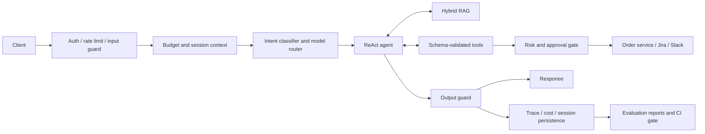

# OpsPilot

[](https://github.com/sompandey95/Opspilot/actions/workflows/ci.yml)

OpsPilot is a production-shaped AI support agent for **ShopEasy**, a fictional
Indian e-commerce company. It combines hybrid retrieval, schema-validated
business tools, human approval for risky actions, guardrails, cost tracing,
and a golden-set evaluation harness.

The project focuses on the engineering around an agent that can take actions:
how to ground answers in changing policy, prevent unsafe tool execution,
preserve retry safety, observe cost, and detect behavioural regressions.

> **Project status:** the current prompt is `v3`. The unit suite contains 301
> passing tests at this revision. Published `v1` and `v2` values are historical
> local results; run and preserve a fresh report before describing `v3`
> performance.

## Capabilities

- **Hybrid RAG:** ChromaDB vector search and BM25 keyword search, combined with
  Reciprocal Rank Fusion and a cross-encoder reranker.
- **Tool execution:** 11 registered tools for knowledge retrieval, order
  operations, Jira, Slack, and escalation. Every generated argument object is
  validated against JSON Schema.
- **Human-in-the-loop controls:** low- and medium-risk actions are audited;
  high-risk actions create a Postgres approval request.
- **Guardrails:** supported Indian PII masking, deterministic injection checks,
  output claim flags, and low-confidence escalation.
- **Operational controls:** Redis sessions, context summarization, per-org token
  budgets, rate limiting, retry protection, structured traces, and estimated
  cost per model call.
- **Evaluation:** 30 golden scenarios covering FAQ, mixed Hindi-English,
  actions, adversarial inputs, stale knowledge, edge cases, and escalation.

## Architecture



See [Architecture](docs/architecture.md) for the request lifecycle, retrieval
pipeline, persistence model, and failure posture.

## Stack

Python 3.11+ · FastAPI · PostgreSQL 16 · Redis 7 · ChromaDB 1.5.9 · Azure
OpenAI · asyncpg · Docker Compose · pytest

The order service is a deterministic local service with 500 fixtures. Jira and
Slack adapters make HTTP calls only when their credentials are configured.

## Quickstart

### 1. Install the application

```bash
git clone https://github.com/sompandey95/Opspilot.git
cd Opspilot

python3 -m venv .venv
source .venv/bin/activate
python -m pip install -e ".[dev]"
cp .env.example .env
```

Add Azure OpenAI credentials and deployment names to `.env`.

### 2. Start dependencies

```bash
docker compose up -d
alembic upgrade head
python scripts/ingest_knowledge.py --reset
```

### 3. Start the API

```bash
uvicorn app.main:app --reload
```

The API is available at `http://localhost:8000`; interactive API documentation
is at `http://localhost:8000/docs`.

```bash
curl http://localhost:8000/api/v1/health
```

Expected shape after successful ingestion:

```json
{
  "status": "healthy",
  "postgres": true,
  "redis": true,
  "chromadb": true,
  "chromadb_docs": 90
}
```

### 4. Open the system console

The development console exposes chat, pipeline stages, the approval queue,
trace timelines, cost metrics, and evaluation status.

```bash
python -m http.server 3000 --directory frontend
```

Open `http://localhost:3000` and keep the API at its default URL, or update the
console connection settings.

## Demonstrated workflows

### Freshness-aware policy retrieval

The knowledge base intentionally contains an older seven-day electronics
return policy and a newer dated changelog that extends the window to ten days.
The retriever is expected to surface the changelog and the prompt instructs the
agent to prefer dated updates over older policy text.

```bash
curl -sS -X POST http://localhost:8000/api/v1/chat \
  -H "Content-Type: application/json" \
  -d '{"query":"How many days do I have to return electronics?"}'
```

### High-risk refund approval

Refunds above the configured auto-approval limit create a pending approval
instead of executing immediately:

```bash
curl -sS -X POST http://localhost:8000/api/v1/chat \
  -H "Content-Type: application/json" \
  -d '{"query":"My order ORD-2024-78432 is very late. Please refund it."}'
```

In another terminal, inspect and decide the request:

```bash
curl -sS http://localhost:8000/api/v1/hitl/pending

curl -sS -X POST http://localhost:8000/api/v1/hitl/approve/REQUEST_ID \
  -H "Content-Type: application/json" \
  -d '{"decided_by":"support-lead@shopeasy.in"}'
```

The original implementation waits for the decision on the same HTTP request.
See [Limitations](docs/limitations.md) for the production alternative.

### Traces and costs

```bash
curl -sS "http://localhost:8000/api/v1/admin/metrics/summary?last=1h"
curl -sS "http://localhost:8000/api/v1/admin/metrics/cost-breakdown?last=1h"
```

## Evaluation

Each live run exercises the same classifier, agent, tools, guards, and
retriever used by the API. Four metrics are gated:

| Metric | Threshold |
|---|---:|
| Tool accuracy | `>= 0.85` |
| Hallucination rate | `<= 0.05` |
| Faithfulness | `>= 0.90` |
| Retrieval recall@K | `>= 0.65` |

Historical local prompt comparison:

| Metric | v1 | v2 | Change |
|---|---:|---:|---:|
| Tool accuracy | 0.763 | 0.893 | +13.0 percentage points |
| Faithfulness | 0.936 | 0.939 | +0.003 |
| Hallucination rate | 3.6% | 3.6% | No change |
| Retrieval recall@5 | 0.70 | 0.70 | No change |
| Average cost/query | INR 0.4286 | INR 0.3907 | -9% |
| Gate | Fail | Pass | Pass |

The values above do not certify the active `v3` prompt. The full regression
story, metric definitions, and reproduction steps are in
[Evaluation](docs/evaluation.md).

Running the live harness calls Azure OpenAI and incurs usage charges:

```bash
docker compose restart mock-order-service
python scripts/check_golden_dataset.py
python scripts/run_evals.py
python evals/ci/eval_gate.py --latest
```

## Tests

Unit and integration tests mock LLM and third-party network calls. Order tools
are tested against the real in-process mock service.

```bash
python -m pytest
```

The secret-free CI workflow also runs Ruff, the test suite, and the golden-set
consistency checker on pushes and pull requests.

## Repository layout

```text
app/             API, agent, retrieval, tools, guardrails and observability
evals/           Golden data, judges, runners and gate logic
knowledge_base/  Fictional FAQs, policies, tickets, API docs and changelogs
mock_services/   Deterministic order service
frontend/        Dependency-free development console
scripts/         Ingestion, evaluation and report commands
tests/           Unit and integration tests
alembic/         Database migrations
docs/            Architecture, evaluation methodology and limitations
```

## Current limitations

The project has no production traffic, SLO history, load test, or
disaster-recovery exercise. High-risk approvals use a blocking request model,
retry protection is not atomic across concurrent requests, and the guardrails
are deterministic rather than comprehensive. Read the complete
[limitations](docs/limitations.md) before adapting the service for deployment.
