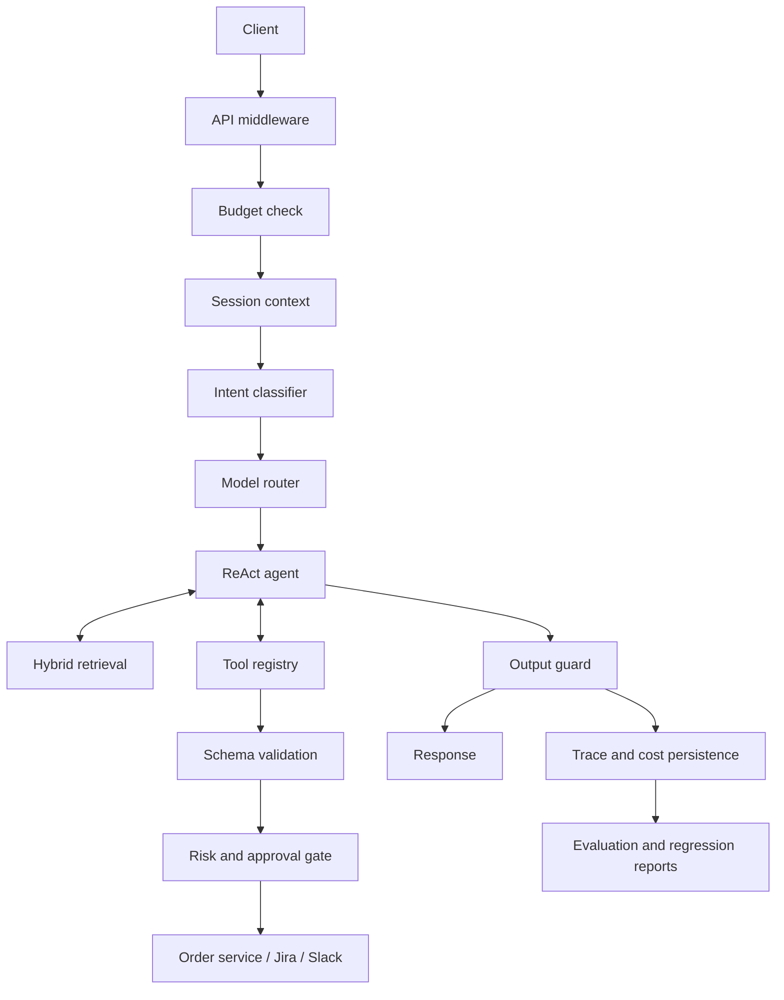

# Architecture

OpsPilot is a production-shaped AI support service for ShopEasy, a fictional
Indian e-commerce company. The system separates language-model reasoning from
business actions, approval policy, persistence, and evaluation.

## Request path

1. `APIMiddleware` adds a request ID, checks optional API-key authentication,
   applies a Redis-backed rate limit, masks supported PII, and blocks known
   prompt-injection phrases.
2. The chat route checks the organisation's token budget and loads session
   history from Redis.
3. A lightweight model classifies intent, sentiment, language, and order ID.
   Classification failures take the safer, more capable agent route.
4. `ModelRouter` selects the configured Azure OpenAI deployment.
5. `ReActAgent` alternates between model responses and schema-validated tool
   calls until it has an answer, reaches its step limit, or escalates.
6. The output guard masks supported PII and records unsupported factual claims
   and tone problems on the trace.
7. The route persists the trace, records token usage, and saves the updated
   session history. Persistence failures do not suppress an otherwise valid
   customer response.

The implementation is in `app/api/routes.py`, `app/api/middleware.py`, and
`app/agent/react_agent.py`.

## Retrieval

The knowledge base contains FAQs, policies, support tickets, API documentation,
and dated changelogs. Ingestion applies document-specific chunking, semantic
deduplication, Azure OpenAI embeddings, and ChromaDB persistence.

At query time, the retriever combines:

- ChromaDB vector search.
- An in-memory BM25 index.
- Reciprocal Rank Fusion (RRF) over vector and keyword ranks.
- A cross-encoder reranker over the fused candidates.
- A freshness boost for dated changelog entries.

Blocking ChromaDB and sentence-transformer calls run through
`asyncio.to_thread` so they do not block the FastAPI event loop.

## Tools and approvals

Tools declare a JSON schema, risk level, and whether they change state. The
agent validates every generated argument object before execution. Validation
errors are returned to the model as tool observations so it can correct the
call within the same bounded loop.

| Risk | Behaviour |
|---|---|
| `NONE` | Execute directly. |
| `LOW` | Auto-approve and record the decision. |
| `MEDIUM` | Auto-approve, audit, and optionally notify Slack. |
| `HIGH` | Create a Postgres approval request and wait for a supervisor decision. |

Refund risk is amount-sensitive. Explicit refunds at or below the configured
limit are medium risk; larger refunds and refunds without an explicit amount
are high risk. Low confidence also forces high-risk review.

Successful state-changing tool results are cached in Redis for 24 hours using
a hash of the tool name and canonical arguments. This protects sequential
retries; the concurrency limitation is documented in `docs/limitations.md`.

## State and persistence

- **PostgreSQL** stores traces, approval requests, audit records, and eval runs.
- **Redis** stores session history, usage budgets, rate-limit windows, and
  successful state-changing tool results.
- **ChromaDB** stores embedded knowledge chunks.
- **Mock order service** provides 500 deterministic orders for development and
  evaluation.

Session history has a sliding TTL. When a conversation exceeds the context
budget, earlier messages are summarized and the last few exchanges remain
verbatim. A deterministic post-check preserves order IDs and customer
identifiers that a summary might omit.

## Failure posture

Subsystems have explicit failure behaviour:

- Missing Azure credentials disable the agent.
- Missing vector-search credentials fall back to BM25-only retrieval.
- Rate limiting fails open when Redis is unavailable.
- Token budgets fail open when Redis is unavailable.
- Approval-queue failures reject gated actions.
- Trace and audit persistence are best effort.
- Low confidence, model errors, and step exhaustion escalate instead of
  returning an ungrounded answer.

These choices make the demo resilient, but they are not a substitute for a
production deployment review. See `docs/limitations.md`.

## Evaluation boundary

The evaluation harness runs the same classifier, agent, tools, guards, and
retriever used by the API. Prompt versions flow into traces and eval reports,
which makes prompt-only comparisons possible. Dataset invariants depend on
stable mock order IDs and stable chunk IDs; run
`python scripts/check_golden_dataset.py` after changing either source.

Detailed metrics and reproduction steps are in `docs/evaluation.md`.
